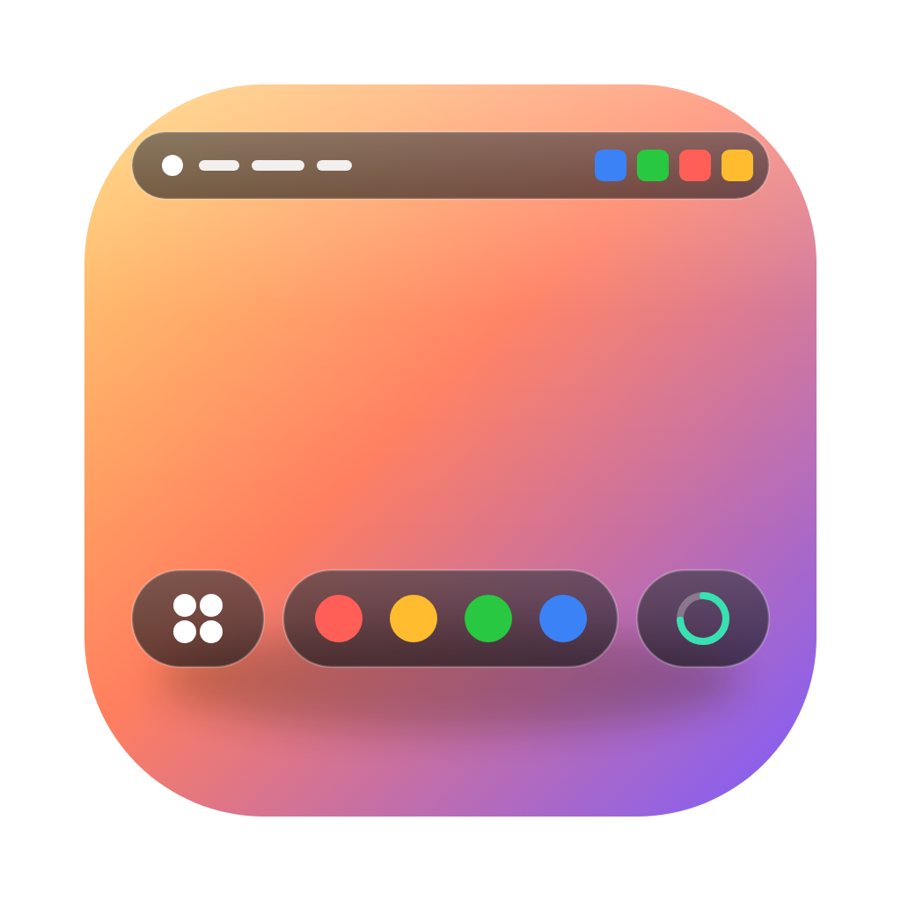
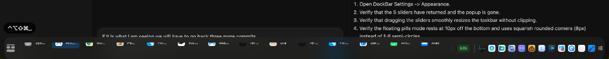

# DockBar

> **A Windows-style taskbar for macOS** — native AppKit, zero dependencies, beautiful glass UI.

<p align="center">
  
</p>

<p align="center">
  
</p>

<p align="center">
  
  
  
  
</p>

---

macOS shows you **apps**, not **windows**. DockBar fixes that.

It sits at the bottom of your screen — like the Windows taskbar — and shows you every open window as its own button. One click to switch, right-click for a full action menu. No Cmd+Tab roulette, no Mission Control hunting.

---

## Features

### Core Taskbar
- **Per-window task buttons** — one button per open window, not per app
- **Floating compact glass mode** — a pill-shaped bar that doesn't take up your whole screen
- **Full-width mode** — classic Windows-style edge-to-edge bar
- **Multi-monitor** — separate bar on each display showing only that screen's windows
- **Minimized windows stay visible** — dimmed badge (Windows-style), click to restore
- **Stable ordering** — windows stay where they are, no MRU jump surprises
- **Drag to reorder** — rearrange task buttons freely
- **Window Grouping** — optionally group multiple windows of the same app and click to effortlessly cycle through them.

### Window Switching & Restoration
- **Option+Tab window switcher** — cycles individual windows (not apps) with a glass thumbnail overlay
- **Hover thumbnails** — live window previews via ScreenCaptureKit
- **Middle-click** a button to close that window instantly
- **AppBeBack Integration** — access your recently closed apps right from the menu bar to instantly restore them.

### System Tray & Menu Bar
- **Menu Bar Battery Gauge** — beautifully rendered, dynamically updating battery status icon right in your Mac's menu bar.
- **Dynamic Calendar** — a live, auto-formatting calendar icon that shows the current date and opens Quick Settings.
- **Quick Settings panel** — Windows-style action center with a grid of toggles:
  - 🌙 Dark Mode  
  - 🔇 Mute Audio  
  - 🎙️ Mute Mic  
  - ☕ Keep Awake  
  - 📡 Bluetooth  
  - 🗂️ Hide Desktop  
  - 👁️ Hidden Files  
- **Volume slider** — real-time CoreAudio volume control directly in the panel

### Launcher Zone
- **Pinned apps** — pin any app to the left launcher zone
- **Apps launcher shortcut** — customizable keyboard shortcut (default: Control+Option+Return)

### System Resource Widget
- Collapsible MEM/CPU/GPU widget
- Per-metric toggles
- Click to open Activity Monitor

### Appearance & Settings
- **Personalized Onboarding** — pick your layout (Compact vs Full Width) and grouping mode right on first launch.
- Configurable taskbar height, font size, max button width
- Icon-only mode or full Window Titles
- Window grouping by app with group indicator dots
- Dock coexistence — auto-hide, independent, or hidden modes

---

## ⚠️ Upgrading to v1.4.0+

> **Important Upgrade Note:** As of v1.4.0, the app's bundle identifier has been officially renamed to `com.dockbar.app`. macOS will treat this as a completely new application. 
> * You will need to **re-grant Accessibility and Screen Recording permissions**.
> * Your old settings (stored under `com.deskbar.app`) will not automatically carry over.

---

## Install

### Download (Recommended)
Download the latest **DockBar.dmg** or **DockBar.zip** from [Releases](https://github.com/wakilibaraka/dockbar/releases), open the DMG, and drag `DockBar.app` into your `/Applications` folder.

### Build from Source
```bash
git clone https://github.com/wakilibaraka/dockbar.git
cd dockbar
swift build -c release
bash scripts/package.sh
cp -r .build/release/DockBar.app /Applications/
open /Applications/DockBar.app
```

No Xcode required — only the Swift toolchain (`xcode-select --install`).

---

## First Launch & Permissions

1. **Accessibility permission** — required for window detection and switching.
   - Go to **System Settings** → **Privacy & Security** → **Accessibility** → enable **DockBar**.
2. **Screen Recording permission** (optional) — required for live hover thumbnails and window switcher previews.
   - Go to **System Settings** → **Privacy & Security** → **Screen Recording** → enable **DockBar**.

---

## Clean Uninstall & Reset Permissions

If you want to completely remove DockBar or perform a fresh reinstall (e.g. using [Pearcleaner](https://github.com/alienator88/Pearcleaner)):

1. **Quit the App**:
   ```bash
   killall DockBar 2>/dev/null || true
   killall DeskBar 2>/dev/null || true
   ```

2. **Remove Application**:
   ```bash
   rm -rf /Applications/DockBar.app /Applications/DeskBar.app
   ```

3. **Reset System Permissions**:
   ```bash
   tccutil reset Accessibility com.dockbar.app
   tccutil reset ScreenCapture com.dockbar.app
   ```

4. **Delete Application Support & Preferences**:
   ```bash
   defaults delete com.dockbar.app 2>/dev/null || true
   rm -rf ~/Library/Application\ Support/DockBar
   rm -rf ~/Library/Application\ Support/DeskBar
   rm -rf ~/Library/Application\ Support/com.dockbar.app
   rm -rf ~/Library/Preferences/com.dockbar.app.plist
   rm -rf ~/Library/Caches/com.dockbar.app
   rm -rf ~/Library/LaunchAgents/com.dockbar.app.plist
   rm -rf ~/Library/LaunchAgents/com.dockbar.dock-watchdog.plist
   ```

---

## Usage

| Action | Result |
|--------|--------|
| **Click** a task button | Raise that specific window |
| **Right-click** a task button | Window list, Hide, Pin, Blacklist, Quit |
| **Option+Tab** | Window switcher — cycle all open windows |
| **Hover** a task button | Live window thumbnail |
| **Middle-click** a task button | Close that window |
| **Click Calendar icon** | Open Quick Settings panel |
| **Drag** task buttons | Reorder freely |
| **Menu Bar Battery** | View power status, click for Recently Closed Apps or Settings |

---

## Requirements

- macOS 14.0 (Sonoma) or later
- No external dependencies — pure system frameworks
- No Xcode required to build

---

## Architecture

Pure AppKit — no SwiftUI, no Electron, no web views.

| Component | Description |
|-----------|-------------|
| `TaskbarPanel` | `NSPanel` at `.statusBar` level, non-activating |
| `WindowManager` | AXObserver + CGWindowList polling, two-tier authoritative/provisional storage |
| `AccessibilityService` | `_AXUIElementGetWindow` via dlsym with frame-matching fallback |
| `ThumbnailService` | ScreenCaptureKit with 2s cache |
| `WindowSwitcherService` | Global Option+Tab event tap, glass overlay |
| `QuickSettingsManager` | Modular protocol-based toggle system — 20+ toggles, all extensible |
| `DockManager` | Three-mode Dock control with watchdog LaunchAgent |

---

## Credits

DockBar is a fork of [DeskBar by rajeshgoli](https://github.com/rajeshgoli/deskbar), substantially extended with the Quick Settings system, connectivity tray, enhanced window switcher, and visual improvements.

---

## License

MIT
