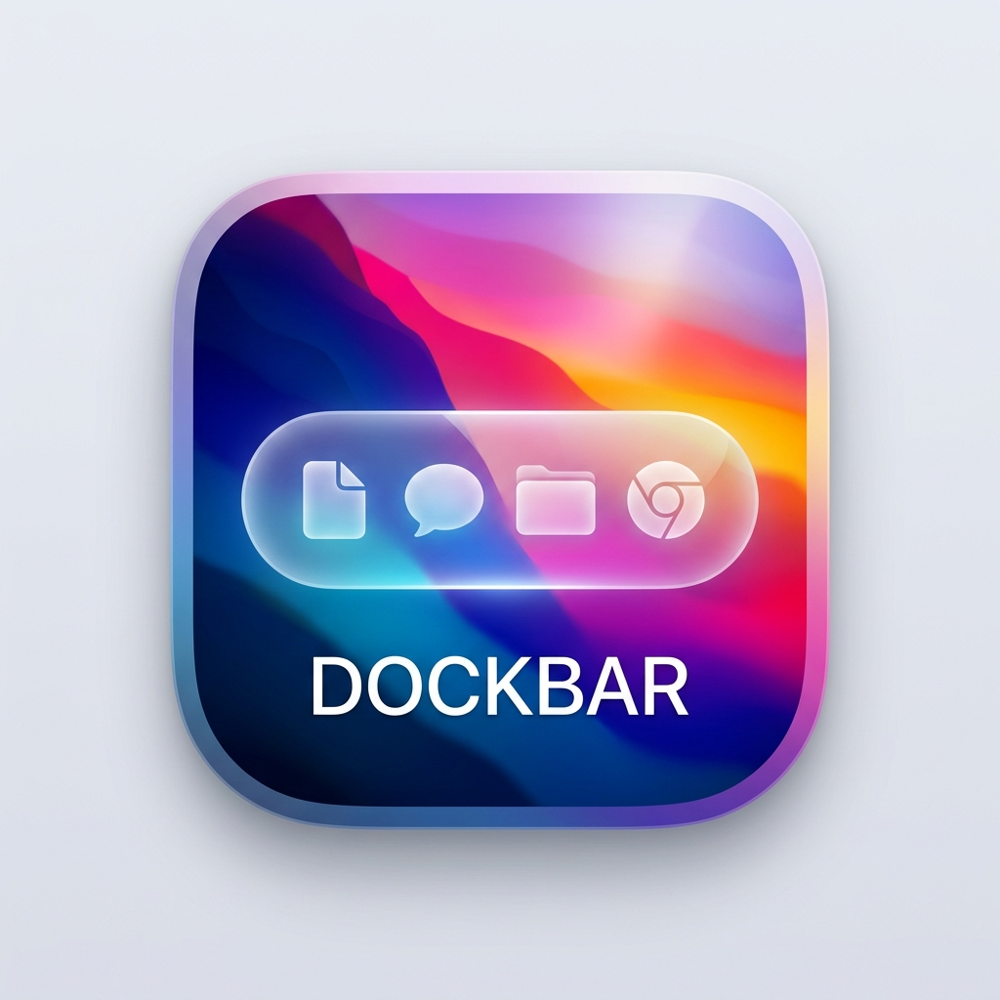

# DockBar

> **A Windows-style taskbar for macOS** — native AppKit, zero dependencies, beautiful glass UI.

<p align="center">
  
</p>

<p align="center">
  
  
  
  
</p>

---

macOS shows you **apps**, not **windows**. DockBar fixes that.

It sits at the bottom of your screen — like the Windows taskbar — and shows you every open window as its own button. One click to switch, right-click for a full action menu. No Cmd+Tab roulette, no Mission Control hunting.

---

## Features

### Core Taskbar
- **Per-window task buttons** — one button per open window, not per app
- **Floating compact glass mode** — a pill-shaped bar that doesn't take up your whole screen
- **Full-width mode** — classic Windows-style edge-to-edge bar
- **Multi-monitor** — separate bar on each display showing only that screen's windows
- **Minimized windows stay visible** — dimmed badge (Windows-style), click to restore
- **Stable ordering** — windows stay where they are, no MRU jump surprises
- **Drag to reorder** — rearrange task buttons freely

### Window Switching
- **Option+Tab window switcher** — cycles individual windows (not apps) with a glass thumbnail overlay
- **Hover thumbnails** — live window previews via ScreenCaptureKit
- **Middle-click** a button to close that window instantly

### System Tray
- **Wi-Fi widget** — shows connection status with SSID and signal quality on hover; click to open Wi-Fi settings
- **Quick Settings panel** — Windows-style action center with a grid of toggles:
  - 🌙 Dark Mode  
  - 🔇 Mute Audio  
  - 🎙️ Mute Mic  
  - ☕ Keep Awake  
  - 📡 Bluetooth  
  - 🗂️ Hide Desktop  
  - 👁️ Hidden Files  
- **Volume slider** — real-time CoreAudio volume control directly in the panel
- **Visual divider** between running apps and system tray

### Launcher Zone
- **Pinned apps** — pin any app to the left launcher zone
- **Apps launcher shortcut** — customizable keyboard shortcut (default: Control+Option+Return)

### System Resource Widget
- Collapsible MEM/CPU/GPU widget
- Per-metric toggles
- Click to open Activity Monitor

### Appearance & Settings
- Configurable taskbar height, font size, max button width
- Icon-only mode (hide window titles)
- Window grouping by app with group indicator dots
- Dock coexistence — auto-hide, independent, or hidden modes

---

## Install

### Download (Recommended)
Download the latest **DockBar-v1.x.x.dmg** from [Releases](https://github.com/wakilibaraka/dockbar/releases), open it, and drag `DockBar.app` to your `/Applications` folder.

### Build from Source
```bash
git clone https://github.com/wakilibaraka/dockbar.git
cd dockbar
swift build -c release
bash scripts/package.sh
cp -r .build/release/DockBar.app /Applications/
open /Applications/DockBar.app
```

No Xcode required — only the Swift toolchain (`xcode-select --install`).

---

## First Launch

1. **Accessibility permission** — a banner will appear. Click it → System Settings → Privacy & Security → Accessibility → add DockBar. Required for window detection.
2. **Screen Recording** (optional) — for hover thumbnails and the window switcher overlay. System Settings → Privacy & Security → Screen Recording → add DockBar.

If you rebuild, you may need to re-grant:
```bash
tccutil reset Accessibility com.deskbar.app
```

---

## Usage

| Action | Result |
|--------|--------|
| **Click** a task button | Raise that specific window |
| **Right-click** a task button | Window list, Hide, Pin, Blacklist, Quit |
| **Option+Tab** | Window switcher — cycle all open windows |
| **Hover** a task button | Live window thumbnail |
| **Middle-click** a task button | Close that window |
| **Click Wi-Fi icon** | Open Wi-Fi settings |
| **Hover Wi-Fi icon** | Show SSID + signal quality |
| **Click ⊟ icon** | Open Quick Settings panel |
| **Drag** task buttons | Reorder freely |
| **Gear** in menu bar | Open Settings or Quit |

---

## Requirements

- macOS 14.0 (Sonoma) or later
- No external dependencies — pure system frameworks
- No Xcode required to build

---

## Architecture

Pure AppKit — no SwiftUI, no Electron, no web views.

| Component | Description |
|-----------|-------------|
| `TaskbarPanel` | `NSPanel` at `.statusBar` level, non-activating |
| `WindowManager` | AXObserver + CGWindowList polling, two-tier authoritative/provisional storage |
| `AccessibilityService` | `_AXUIElementGetWindow` via dlsym with frame-matching fallback |
| `ThumbnailService` | ScreenCaptureKit with 2s cache |
| `WindowSwitcherService` | Global Option+Tab event tap, glass overlay |
| `QuickSettingsManager` | Modular protocol-based toggle system — 20+ toggles, all extensible |
| `DockManager` | Three-mode Dock control with watchdog LaunchAgent |
| `ConnectivityTrayView` | CoreWLAN Wi-Fi status + CoreAudio volume |

---

## Credits

DockBar is a fork of [DeskBar by rajeshgoli](https://github.com/rajeshgoli/deskbar), substantially extended with the Quick Settings system, connectivity tray, enhanced window switcher, and visual improvements.

---

## License

MIT
